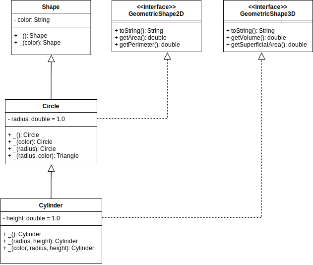
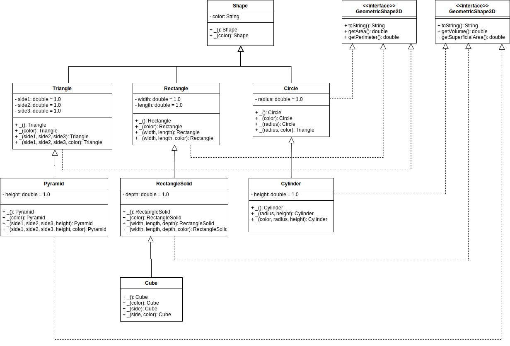
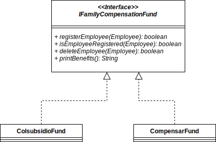

# LAB-INTERFACES

## Dependencias

* Laboratorio de clases abstractas.
* Laboratorio de herencia.

## Parte I - Entendiendo las Interfaces `Shapes`

* Use la implementación que realizo a lo largo de los laboratorios de herencia y clases abstratas para lograr que las pruebas de `CircleTest` pasen de forma efectiva.
* Lea atentamente el siguiente diagrama y responda:
    * ¿Cuál es la relación entre `Circle` y `Shape`?
    * ¿Cuál es la relación entre `Cylinder` y `Shape`?
    * ¿Cuál es la relación entre `Circle` y `GeometricShape2D`?
    * ¿Cuál es la relación entre `Cylinder` y `GeometricShape3D`?

* Lea atentamente las clases `Circle`, `Cylinder`, `GeometricShape2D`, `GeometricShape3D` y `Shape`.
* Use la implementación de los métodos de `getArea` y `getPerimeter` que realizo en el laboratorio de herencia para completar la implementación de `Circle`.
* Verifique que todas las pruebas de `CircleTest` pasen de forma efectiva.
* Para la clase `Cylinder`, sobreescriba el método `getVolume` de tal forma que todas las pruebas de la clase `CylinderTest` para ese método pasen. Agrege pruebas adicionales.
* Para la clase `Cylinder`, sobreescriba el método `getSuperficialArea` de tal forma que todas las pruebas de la clase `CylinderTest` para ese método pasen. Agrege pruebas adicionales.
* Tome una captura de pantalla como evidencia de las pruebas que logro ejecutar de forma exitosa.

## Parte II - Implementando Interfaces

En el diagrama anterior se definen las clases `Triangle`, `Pyramid`, `Rectangle`, `RectangleSolid` y `Cube`.

### Implementando `GeometricShape2D`

* Cree las clases `Triangle` y `Rectangle`. 
* Haga que las clases hereden de `Shape`.
* Haga que las clases implementen la interfaz `GeometricShape2D`.
* Cree las clases de pruebas `TriangleTest` y `RectangleTest`.
* Agregue pruebas para los métodos `getArea` y `getPerimeter`, asegurese de usar todos los constructores de las clases que se están probando.
* Realice las implementaciones que necesite en las clases `Triangle` y `Rectangle` para que las pruebas que definio pasen.

### Implementando `GeometricShape3D`

* Cree las clases `Pyramid` y `RectangleSolid`. 
* Haga que las clases hereden de `Triangle` y `Rectangle` según corresponda.
* Haga que las clases implementen la interfaz `GeometricShape3D`.
* Cree las clases de pruebas `PyramidTest` y `RectangleSolidTest`.
* Agregue pruebas para los métodos `getArea`, `getPerimeter`, `getVolume` y `getSuperficialArea`, asegurese de usar todos los constructores de las clases que se están probando.
* Realice las implementaciones que necesite en las clases `Pyramid` y `RectangleSolid` para que las pruebas que definio pasen.

### `Cube`

* Cree la clase Cube.
* Haga que la clase herede de `RectangleSolid`.
* Cree la clase de pruebas `CubeTest`.
* Agregue pruebas para los métodos `getArea`, `getPerimeter`, `getVolume` y `getSuperficialArea`, asegurese de usar todos los constructores de la clase `Cube`.
* Todas las pruebas deberían pasar inmediatamente sin hacer modificaciones en la clase `Cube`.

## Parte III - Diseñando Interfaces

* Diseñe la clase `Sphere`. Recuerde que es un solido que puede derivarse de la clase `Circle`.
* Diseñe la interfaz `TrigonometricShape`, esta interfaz define que de un figura se pueden calcular:
    * `getSen` - Obtener el seno.
    * `getCos` - Obtener el coseno.
    * `getTan` - Obtener la tangente.
* Indique que la clase `Triangle` implementa esta interfaz.
* NO modifique el código, solo exponga la propuesta del nuevo diseño.
* En el archivo de SOLUTION.md cargue las imagenes de sus diseños.

## Parte IV - Interfaces Implementando en un contexto

Las cajas de compensación son esenciales a la hora de hablar de un sistema de Nomina, para el caso del sistema `SabanaPayroll` vamos a contar con dos posibles opciones, `ColsubsidioFund` y `CompensarFund`, cada una de ellas es capaz de:

* Registrar a un empleado
* Informar si un empleado esta registrado
* Eliminar a un empleado
* Imprimir la lista de los beneficios

La única diferencia entre `ColsubsidioFund` y `CompensarFund` además de sus beneficios, es la forma en la que manejan el registro de los empleados inscritos, `ColsubsidioFund` basa su funcionalidad en un `HashMap`, no permite empleados que sean pagados por comision y `CompensarFund` basa su funcionalidad en un `List` y no permite empleados que sean pagados por horas. Revise con atención el código de dichas clases.

* Lea el diagrama de clases propuesto.
* El laboratorio tiene adjunto el código de las clases propuestas y las pruebas, integre el código del laboratorio anterior.
* Lea las pruebas con atención.
* Implemente el código necesario en la clase `ColsubsidioFund` para que las pruebas de la clase `ColsubsidioFundTest` pasen.
* Cree la clase `CompensarFundTest` y agregue pruebas similares.
* Implemente el código necesario en la clase `CompensarFund` para que las pruebas de la clase `CompensarFundTest` pasen.
* Cree una tercera caja de compensación llamada `CafamFund` haga que esta implementación maneje el registro de empleados usando un `Set`, este permitirá el registro de todos los tipos de empleado, cree la clase `CafamFundTest` agregue los tests correspondientes e implemente el código necesario para que las pruebas pasen.   
 
## Parte V - Interfaces Integrando

1. Use el diagrama de clases inicial para terminar de diseñar el sistema completo, incluya todo lo que considere necesario, atributos, métodos, relaciones.
2. Diseñe el diagrama de secuencia para los métodos `assigneFamilyCompensation`.
3. A la clase `SabanaNominaTest` que ya debe existir agregue diversas pruebas para los métodos anteriormente mencionados. (Revise las pruebas adjuntas como una base para las suyas.)
4. Implemente los métodos y asegurese que las pruebas están bien diseñadas y se ejecutan de manera correcta. (Revise el código adjunto como una guía para su código)
5. En el archivo de SOLUTION.md cargue las imagenes de sus diseños y evidencia de ejecución de pruebas.

## Parte VI - Interfaces Diseñando en un contexto

Diseñe el siguiente caso de negocio, no modifique el código, solo proponga el diseño. En el archivo de SOLUTION.md cargue las imagenes de sus diseños.

La universidad ha decidido integrar el sistema de EPS's al sistema de nomina, para hacerlo comenzará con tres empresas, `CompensarEPS`, `SanitasEPS` y `ProteccionEPS`. Las tres compañías deben soportar el comportamiento de:

* `registerEmployee`.
* `isEmployeeRegistered`.
* `deleteEmploye`.
* `discountInabilityFee`.

 ## Condiciones
 
 * Todos los editables de los diagramas de este laboratorio se encuentran en la carpeta `diagrams`.
 * Cree un repositorio llamado APELLIDO1-APELLIDO2-APELLIDO3-SABANA-POOB-2021-1-LAB-ABSTRACT-CLASS en GitHub y suba a llí la solución del laboratiorio.
 * Cree un archivo SOLUTION.md donde deberá documentar toda la solución del laboratorio. NO MODIFIQUE EL README.md.
